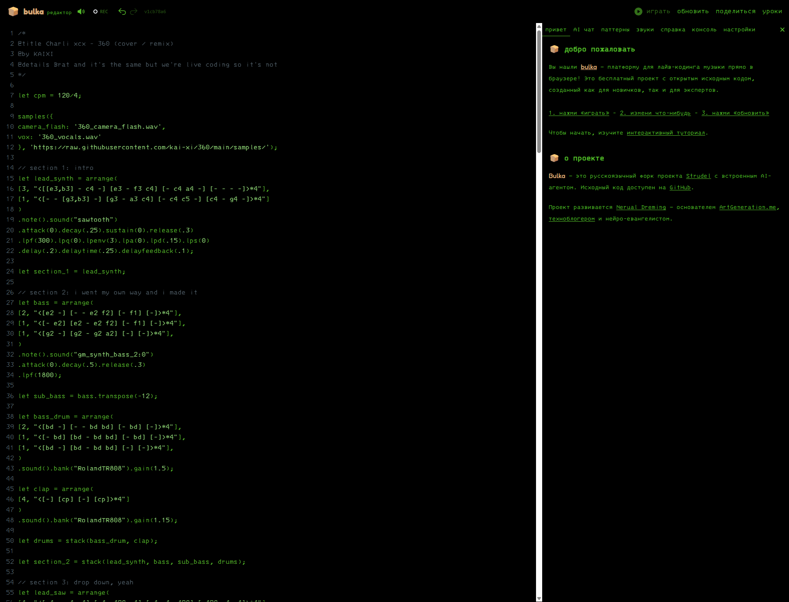
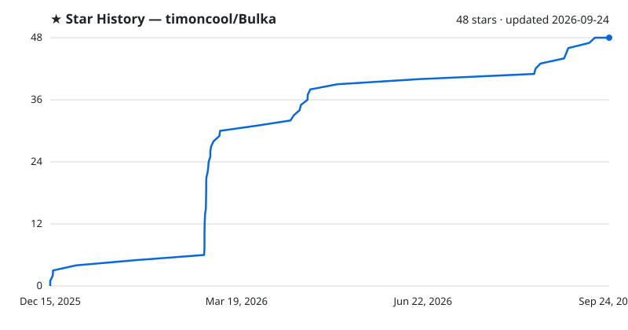

<div align="center">

# Bulka

**Платформа для лайв-кодинга музыки с AI-агентом — пиши код, создавай музыку в реальном времени.**

[](https://github.com/timoncool/Bulka/stargazers)
[](LICENSE)
[](https://github.com/timoncool/Bulka/commits)
[](https://bulka.app/)

[bulka.app](https://bulka.app/) · [⬇️ Скачать для Windows](https://github.com/timoncool/Bulka/releases/latest) · [Telegram](https://t.me/bulka_app) · [Скриншоты](SCREENSHOTS.md)



</div>

---

## Что это?

**Bulka** — это браузерный редактор для создания музыки кодом в реальном времени. Открываешь сайт, пишешь пару строчек — музыка играет мгновенно. Никаких установок, DAW или плагинов.

Это русскоязычный форк [Strudel](https://strudel.cc/) с встроенным AI-агентом, который помогает писать код, объясняет как что работает и ищет по документации. Идеально подходит как для музыкантов, которые хотят попробовать программирование, так и для программистов, которые хотят делать музыку.

**Для кого:**
- Музыканты и продюсеры — новый инструмент для live-выступлений и экспериментов
- Программисты — творчество через код, generative-музыка и algorave
- Новички — самый простой способ начать программировать (через музыку это весело)
- VJ и визуальщики — встроенная Hydra для live-визуалов синхронно с музыкой

## Ключевые возможности

**🤖 AI-агент (теперь бесплатно!)**
Встроенный ассистент на базе GPT-5.2, Claude Opus 4.5 или Gemini 3 Pro. Пишешь "сделай техно-бит" — получаешь готовый код. Агент умеет редактировать твой код, искать по документации и объяснять как всё работает. Для продвинутых моделей видно процесс рассуждения в реальном времени.

**🆓 Бесплатный режим — без ключа и регистрации**
Агент работает бесплатно через [OVHcloud AI Endpoints](https://endpoints.ai.cloud.ovh.net/): запросы идут прямо из браузера, без API-ключа и без регистрации, с моделями с открытыми весами (GPT-OSS, Llama, Qwen, Mistral). Лимит бесплатного тарифа — 2 запроса в минуту на IP; для моделей без поддержки инструментов Bulka симулирует их текстовыми маркерами (код сам вставляется в редактор и запускается). Нужно больше и стабильнее — подключи свой ключ (OpenAI/Anthropic/Gemini) или OpenRouter.

**🎵 Мгновенное воспроизведение**
Изменил код → нажал Ctrl+Enter → музыка обновилась. Никаких рендеров и экспортов. Всё происходит в браузере через Web Audio API. Сотни готовых сэмплов и синтезаторов уже встроены. Можно загружать свои звуки.

**🎙️ Запись треков**
Одна кнопка — и всё что играет записывается в WAV. Сразу можешь скачать готовый трек или продолжить дорабатывать в DAW.

**🎨 Live-визуалы**
Встроенная Hydra синхронизируется с музыкой. Пишешь код для звука и визуалов в одном окне. Идеально для VJ-сетов и live-выступлений.

**🎛️ Свежий движок (синхронизирован со Strudel)**
Движок подтягивает обновления официального [Strudel](https://codeberg.org/uzu/strudel): микротональность и ксеногармония (`edoScale`, `xen`, `tune`), продвинутая модуляция (LFO и огибающие `env` с retrig), новые синтезаторы (wavetable, многооператорный FM, transient shaper), улучшенный MIDI (MIDI-клавиатура, каналы, точный тайминг) и офлайн-экспорт в WAV (вкладка «экспорт» — точнее и быстрее живой записи). Все новые функции описаны в справочнике на русском.

**📚 Интерактивная документация**
Не нужно гуглить — вся документация встроена в редактор с live-примерами. Кликнул на функцию → увидел что она делает → скопировал себе. Полностью на русском языке.

## Быстрый старт

Открой [bulka.app](https://bulka.app/) и вставь этот код:

```javascript
// Простой drum-паттерн
s("bd sd bd sd, hh*8")

// Добавь басовую линию
note("c2 e2 g2 a2").s("sawtooth").lpf(800)
```

Нажми **Play** или **Ctrl+Enter** — всё, музыка играет!

Дальше можешь:
- Спросить у AI-агента: "добавь кислотный бас"
- Изменить код и нажать **Update** (Ctrl+Enter снова)
- Нажать **Record** чтобы записать трек в WAV
- Открыть панель **Sounds** и выбрать другие сэмплы
- Нажать `/` и начать вводить название функции для поиска по документации

## Десктоп-версия для Windows

Не хочешь браузер — есть **портативное приложение** (всё работает локально, в одной папке):

- **Установщик:** скачай [`Bulka_x64-setup.exe`](https://github.com/timoncool/Bulka/releases/latest) → запусти → ярлык «Bulka». Ставится без прав администратора и **сам обновляется** с новых релизов.
- **Портатив:** скачай `Bulka-portable.zip` → распакуй → запусти `Bulka.exe`. Ничего не пишется в систему — удалил папку, удалил приложение.

Свои API-ключи вводятся в настройках и хранятся **в папке приложения**; либо используй **бесплатный режим (OVHcloud)** без ключа. Закрыл окно — всё закрылось. Требуется Windows 10/11 x64.

## Разработка

Хочешь запустить локально или доработать проект:

```bash
git clone https://github.com/timoncool/Bulka.git
cd Bulka
pnpm i      # нужен Node.js 18+ и pnpm
pnpm dev    # сайт откроется на localhost:4321
```

Пакеты Bulka доступны на npm под неймспейсом `@strudel` — можешь встроить редактор в свой проект. Подробности в [документации](https://strudel.cc/technical-manual/project-start).

## Автор

Проект развивается [Nerual Dreming](https://t.me/nerual_dreming) — основателем [ArtGeneration.me](https://artgeneration.me/), [техноблогером](https://www.youtube.com/@nerual_dreming) и нейро-евангелистом.

## Благодарности

Bulka основана на проекте [Strudel](https://strudel.cc/) от Alex McLean и сообщества. Спасибо всем контрибьюторам оригинального проекта.

Бесплатный AI-режим работает на [OVHcloud AI Endpoints](https://endpoints.ai.cloud.ovh.net/) — спасибо OVHcloud за бесплатный анонимный доступ к моделям с открытыми весами.

## 🌍 Сообщество

### Bulka (русскоязычное)
- **Telegram**: [t.me/bulka_app](https://t.me/bulka_app) — обсуждения, помощь, новости проекта
- **GitHub**: [github.com/timoncool/Bulka](https://github.com/timoncool/Bulka) — код, issues, pull requests

### Strudel/TidalCycles (международное)
- **Discord**: [#strudel](https://discord.com/invite/HGEdXmRkzT) — 7000+ участников
- **Форум**: [club.tidalcycles.org](https://club.tidalcycles.org/) — обсуждения и вопросы

## Другие проекты [@timoncool](https://github.com/timoncool)

| Проект | Описание |
|--------|----------|
| [ACE-Step Studio](https://github.com/timoncool/ACE-Step-Studio) | AI-студия музыки — песни, вокал, каверы, клипы |
| [VideoSOS](https://github.com/timoncool/videosos) | AI-видеопродакшн в браузере |
| [Foundation Music Lab](https://github.com/timoncool/Foundation-Music-Lab) | Генерация музыки + редактор таймлайна |
| [GitLife](https://github.com/timoncool/gitlife) | Жизнь в неделях — интерактивный календарь |
| [telegram-api-mcp](https://github.com/timoncool/telegram-api-mcp) | Telegram Bot API как MCP-сервер |
| [tg-challenge-bot](https://github.com/timoncool/tg-challenge-bot) | AI антиспам-бот для Telegram |

## Поддержать автора

Я создаю опенсорс софт и занимаюсь исследованиями в области ИИ. Большая часть всего, что я делаю, находится в открытом доступе. Ваши пожертвования позволяют мне создавать и исследовать больше, не отвлекаясь на поиск еды для продолжения существования =)

**[Все способы поддержки](https://github.com/timoncool/ACE-Step-Studio/blob/master/DONATE.md)** | **[dalink.to/nerual_dreming](https://dalink.to/nerual_dreming)** | **[boosty.to/neuro_art](https://boosty.to/neuro_art)**

- **BTC:** `1E7dHL22RpyhJGVpcvKdbyZgksSYkYeEBC`
- **ETH (ERC20):** `0xb5db65adf478983186d4897ba92fe2c25c594a0c`
- **USDT (TRC20):** `TQST9Lp2TjK6FiVkn4fwfGUee7NmkxEE7C`


## Star History

<a href="https://github.com/timoncool/Bulka/stargazers">
 <picture>
   <source media="(prefers-color-scheme: dark)" srcset="docs/stars-dark.svg" />
   <source media="(prefers-color-scheme: light)" srcset="docs/stars-light.svg" />
   
 </picture>
</a>

## Лицензия

[GNU Affero General Public License v3.0](LICENSE)
